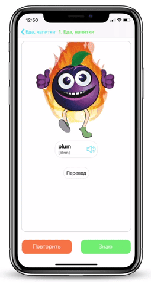
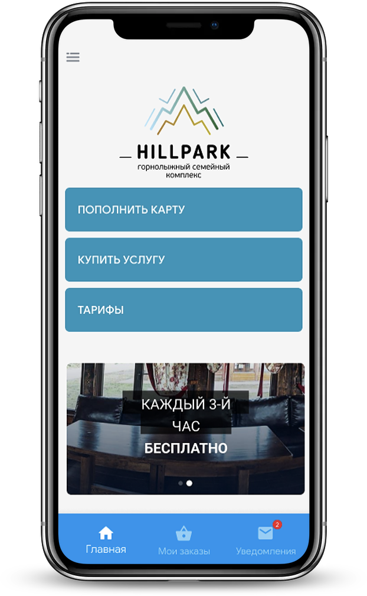
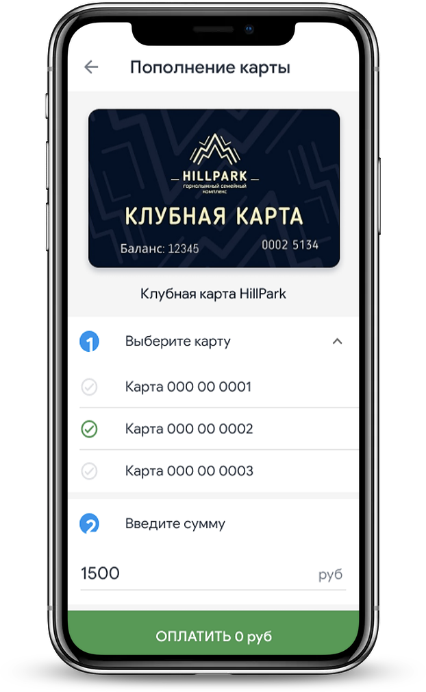
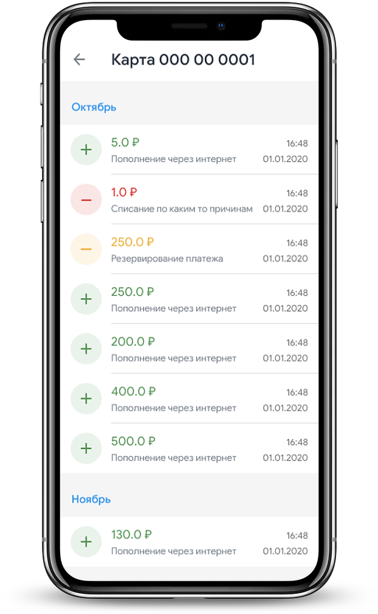

&nbsp;&nbsp;&nbsp; &nbsp;&nbsp;&nbsp;
  
 # Uwords
Uwords - iOS app that helps people(Russian speaking) learn English words. It’s  first commercial app that I developed. 
Idea is to show image that is associated with some word, also you can see transcription of the word and you can listen right pronouncement.

**My role:** Solo iOS developer, I did both, front and back ends

**Technologies used:**
- frontend: UIKit, Alamofire
- backend: Firebase, PHP, MySql
 
  

&nbsp;&nbsp;&nbsp;&nbsp;&nbsp;&nbsp;&nbsp;&nbsp;&nbsp;&nbsp;
  

  <a href="https://apps.apple.com/ru/app/uwords/id1465451850?l=en"><image src="imgs/appStore.svg"></a>
  

 # Hillpark
 Hillpark - my second commercial app. It’s a ski resort app, main task of it is to allow users to pay their ski passes. Besides ski pass payment, is has wide range of functionality: check prices for different offers of resort, see online cameras of ski tracks and much more.
 
 **My role:** Solo iOS developer. App was already published, but it was working very bad. So I rebuilded whole app from scratch. 

**Technologies used:** UIKit, Alamofire, CoreData, WEBKit, Material Components
 
  

&nbsp;&nbsp;&nbsp;&nbsp;&nbsp;&nbsp;&nbsp;&nbsp;&nbsp;&nbsp;
  

  <a href="https://apps.apple.com/ru/app/hillpark/id1439173558?l=en"><image src="imgs/appStore.svg"></a>
  

## Thanks for stopping by!

# Contact info:
- Email: <a href="mailto:alex.k.appd@gmail.com">alex.k.appd@gmail.com</a>
- Telegram: <a href="https://t.me/kolch_a">@kolch_a</a>
- LinkedIn: <a href="https://www.linkedin.com/in/alexey-kolchedanstev-4a19251a6">Alexey Kolchedanstev</a>
