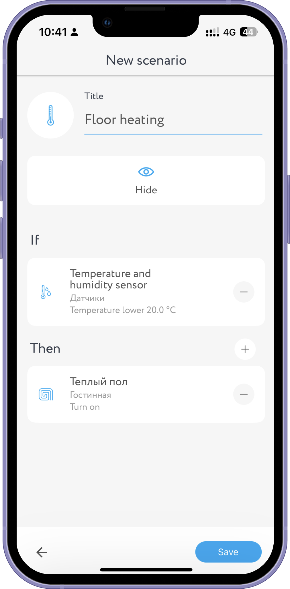
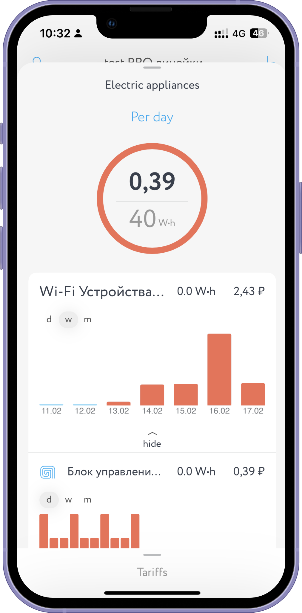

&nbsp;&nbsp;&nbsp; &nbsp;&nbsp;&nbsp;

 # Rubetek
Rubetek is an iOS app that makes it easy for users to control their smart home devices, including cameras, intercoms, and more. I began working on this project as a middle iOS developer, but have since been promoted to team lead. As the team lead, I am responsible for overseeing the global architecture of the app, facilitating communication between different teams, and managing various other aspects of the project. Through my efforts, the app has continued to evolve and improve, offering a seamless and intuitive user experience.
 
**Role:** Middle iOS developer -> iOS Team Lead

**Stack:** UIKit/RxSwift, SwiftUI/Combine, Realm, MVVM, SwiftSocket, CallKit, VoIP, Firebase
 
  

  

  <a href="https://apps.apple.com/ru/app/rubetekhome/id1510751860?l=en"><image src="imgs/appStore.svg"></a>
  

  
  # MacaroonOfEnglish
App that helps users learn English words through a quiz format. The app provides an interactive and engaging way for users to expand their vocabulary and test their knowledge. Unfortunately, the app was never published due to unforeseen circumstances. The person who provided the project disappeared, leaving the app incomplete and unpublished.

**Role:** Full stack developer
**Stack:** UIKit, SwiftUI, Alamofire, Firebase, PHP, MySQL
 
  

&nbsp;&nbsp;&nbsp;&nbsp;&nbsp;&nbsp;&nbsp;&nbsp;&nbsp;&nbsp;

 # Hillpark
This iOS app for a ski resort allows visitors to easily access information about the ski slopes, weather conditions, and other resort amenities. As the developer for this project, I was responsible for rebuilding the app from scratch, adding new features, and ensuring its smooth and reliable performance. The end result was a well-designed and user-friendly app that has enhanced the experience of visitors to the ski resort.
 
 **Role:** iOS developer

**Stack:** UIKit, Alamofire, CoreData, Material Components
 
  

&nbsp;&nbsp;&nbsp;&nbsp;&nbsp;&nbsp;&nbsp;&nbsp;&nbsp;&nbsp;
  

  <a href="https://apps.apple.com/ru/app/hillpark/id1439173558?l=en"><image src="imgs/appStore.svg"></a>
  

## Thanks for stopping by!

# Contact info:
- Email: <a href="mailto:alex.k.appd@gmail.com">alex.k.appd@gmail.com</a>
- Telegram: <a href="https://t.me/kolch_a">@kolch_a</a>
- LinkedIn: <a href="https://www.linkedin.com/in/alexey-kolchedanstev-4a19251a6">Alexey Kolchedanstev</a>
